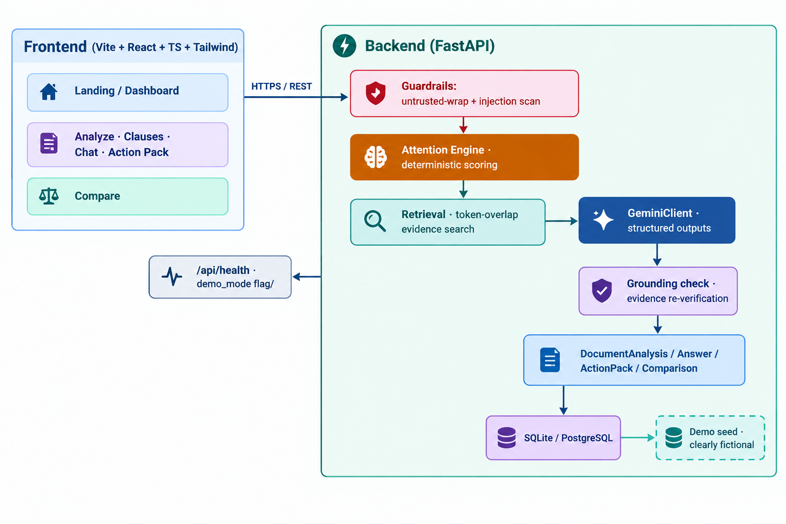

# LegalLens AI

> **Understand before you sign.** — An AI-powered legal document intelligence platform.
> Reads real legal documents, flags high-attention clauses, and answers grounded questions — every insight cites the exact page, section, and original source text.

## What this product demonstrates

- **Real detection, not a generic chatbot**: documents are parsed into clauses, each rated **HIGH / MEDIUM / LOW attention** by an evidence-grounded engine.
- **Evidence-backed answers**: a *deterministic retrieval + grounding* layer finds the relevant passages and the LLM is only shown that evidence; a confidence check downgrades any clause whose support text cannot be found back in the document.
- **Prompt-injection defense**: uploaded document text is treated as untrusted data, wrapped with markers and scanned for embedded instructions before any LLM prompt is built.
- **Contract comparison** and a **pre-signing Action Pack**.
- **Works offline**: ships a preloaded, clearly-fictional sample employment agreement so the full experience runs with zero API keys.

---

## Features

| Feature | What you get |
| --- | --- |
| Attention Radar | Clause-level HIGH / MEDIUM / LOW ratings with a distribution summary |
| Clause explorer | Click any clause → plain meaning, why it matters, verbatim evidence, and an AI "explain in plain language" panel |
| Grounded Q&A | Ask anything; the answer always lists cited page, section, and quote |
| Context ranking | "What matters if I resign after 8 months?" → ranked clauses via a deterministic attention engine |
| Action Pack | Important clauses, questions to ask, things to clarify, info to collect, and questions for a lawyer |
| Compare | Side-by-side contract diff with Added / Removed / Modified / Significant / Review / Minor badges |
| Document viewer | Page-by-page source view with own-clause / evidence highlighting |
| Sample documents | One-click "Try with Sample Document" using the pre-seeded, clearly fictional employment agreements |

---

## Architecture



### Mode behaviour

- **Real AI mode** — used automatically when `GEMINI_API_KEY` is set. All extraction (clauses, Q&A, action pack, comparison) uses `gemini-3.6-flash` with **structured JSON outputs** and one-shot prompts assembled from trusted system policy + untrusted, wrapped document text.
- **Sample documents** — preloaded at startup; analyses are pre-computed, so opening one is instant and never calls Gemini. Real uploaded documents take the AI path instead.

```
request
   ├─ guardrails (wrap + scan untrusted text)
   ├─ Gemini structured call -> raw clause list
   ├─ deterministic attention engine REWEIGHTS importance
   ├─ grounding check: is the supporting quote actually in the doc?
   └─ final analysis stored + served to UI
```

---

## Repository layout

```
F:\LegalSenceAI
│  .env.example            # copy to .env and fill in
│  render.yaml             # Render blueprint (backend + frontend)
│  README.md
├─ backend
│  ├─ app
│  │  ├─ api/              # REST routes + deps (rate limit, workspace)
│  │  ├─ ai/               # Gemini client, structured outputs, guardrails, prompts
│  │  ├─ core/             # settings/config
│  │  ├─ db/               # SQLAlchemy models, repository, demo seed data
│  │  ├─ engine/           # attention engine + evidence retrieval
│  │  ├─ schemas/          # Pydantic models
│  │  ├─ services/         # analysis, Q&A, compare, action pack, upload
│  │  └─ main.py           # FastAPI app factory
│  ├─ samples/             # sample texts (employment, rental, injection file)
│  ├─ tests/               # 43 passing tests
│  └─ requirements.txt
└─ frontend
   ├─ src
   │  ├─ components/       # UI primitives, clause cards/drawer, radar, chat, tables
   │  ├─ pages/            # Landing, Documents, Analyze, Compare, ActionPack, Settings
   │  ├─ layouts/          # app shell (sidebar, mobile nav, workspace)
   │  ├─ context/          # workspace state
   │  ├─ lib/              # typed API client, utils, toast
   │  └─ types/            # TS types mirroring backend schemas
   └─ package.json
```

---

## Quickstart

### Prerequisites
- Python 3.12+ and Node.js 20+ (developed/tested on Python 3.13 / Node 24)

### 1. Backend

```bash
cd backend
python -m venv .venv
# Windows:  .venv\Scripts\activate      macOS/Linux:  source .venv/bin/activate
pip install -r requirements.txt

cp ../.env.example ../.env            # optional; samples work with no key
uvicorn app.main:app --host 0.0.0.0 --port 8000
```

Health check at `http://localhost:8000/api/health`, interactive docs at `/docs`.

> No `GEMINI_API_KEY`? The app still works: the preloaded "Sample" documents answer, chat, rank,
> and compare instantly without Gemini. Set a key to enable real AI analysis for uploaded documents.

### 2. Frontend

```bash
cd frontend
npm install
npm run dev            # http://localhost:5173  (proxies /api to :8000)
```

Production build + preview:

```bash
npm run build && npm run preview
```

### 3. Tests

```bash
cd backend
.venv\Scripts\python -m pytest tests -q     # 43 passed
```

---

## Walkthrough (judge-ready, nothing to install)

1. Open the app → the landing page is the pitch.
2. Click **Try with Sample Document** (or **Documents** → a `Sample` badge shows the two seeded agreements):
   - `sample_employment` — *Employment Agreement, Acme Technologies & Alex Sharma*, 12 pages
   - `sample_contract_b` — *Revised agreement*, 8 pages
3. **Analyze** (instant, pre-computed):
   - Attention radar shows exactly **3 HIGH / 6 MEDIUM / 11 LOW**.
   - Click **Training Repayment** (HIGH) → drawer shows plain meaning, why it matters, verbatim evidence (page 7, §11.2), and the **Explain in plain language** button.
   - **View source** jumps the right panel to page 7 with the quote highlighted.
4. **Chat**: ask *"What happens if I resign after 8 months?"* → the answer cites Training Repayment with page 7, §11.2 quotes, and shows a ranked list of related clauses (Non-Compete, Notice Period, Probation).
5. **Actions** tab → Action Pack with important clauses, questions to ask, checklist, and questions for a lawyer.
6. **Compare**: `sample_employment` vs `sample_contract_b` → 7 difference rows; notice changes **30 days → 90 days** marked **Significant** with both source pages.
7. **Your document**: upload a real PDF/DOCX/TXT → real Gemini analysis (if a key is configured) shows the same flow.

---

## API overview

| Method | Endpoint | Purpose |
| --- | --- | --- |
| GET | `/api/health` | Status + `demo_mode`/`ai_configured` flags |
| POST | `/api/documents/upload` | Upload PDF / DOCX / TXT (≤ 20 MB) |
| GET | `/api/documents` · `/api/documents/{id}` | List / detail |
| POST | `/api/documents/{id}/analyze` | Run the full analysis |
| GET | `/api/documents/{id}/clauses` | Ranked clauses + attention summary |
| POST | `/api/documents/{id}/ask` | Grounded Q&A `{question}` |
| GET | `/api/documents/{id}/context-ranking?context=` | Rank clauses for a situation |
| POST | `/api/documents/{id}/action-pack` | Generate Action Pack |
| POST | `/api/documents/{id}/explain` | Explain a clause `{title}` |
| POST | `/api/compare` | Compare two documents |
| GET | `/api/demo/documents` · `/{id}` | Sample documents metadata |

All AI endpoints are rate-limited per client IP (default 30/min) and scoped by the
`X-Workspace-Id` header (default `public`). Sample documents are readable from any workspace.

---

## Security & responsible AI

- **Prompt-injection defense** — see [docs/security.md](docs/security.md).
- **Grounding & confidence** — answers can never mention text that was not retrieved and re-verified.
- **Responsible-AI notice** — surfaces *"not legal advice, evidence-backed"* throughout the UI, incl. a dedicated page. See [docs/responsible-ai.md](docs/responsible-ai.md).
- **Fictional data** — all sample entities, people, amounts and dates are fictional; the API explicitly reports `fictional_notice`.

---

## Deployment (Render)

`render.yaml` defines:

1. `legallens-backend` — Python web service (`uvicorn ... -p $PORT`)
2. `legallens-frontend` — static site (`npm ci && npm run build`, publish `dist`)

Set `GEMINI_API_KEY`, `FRONTEND_URL` (the deployed frontend origin), and `VITE_API_BASE_URL`
(the public backend URL) in the Render dashboard. Verify:
- `GET <backend>/api/health` → `"status": "UP"`
- The frontend's Try-with-Sample flow works in production.